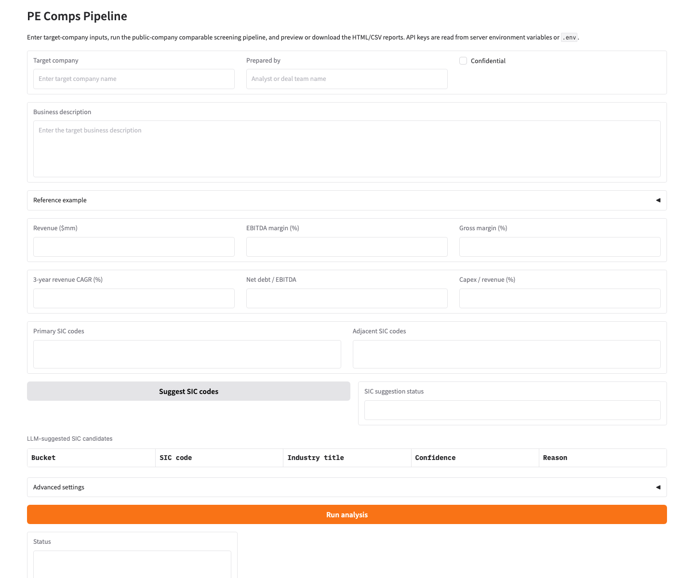

# PE Comps Pipeline

## Project Overview

PE Comps Pipeline helps private equity analysts build a ranked set of public
company comparables for benchmarking a private target company. Given the
target's business description, financial profile, and relevant SIC codes, the
pipeline discovers public peers, enriches them with financial and business-model
features, and produces CSV/HTML comps reports with valuation multiples,
benchmark distributions, and a ranked Top-N comp list selected by business-model
fit and financial-feature similarity to the target.

At a high level, the pipeline:

- discovers candidate tickers dynamically from SEC EDGAR SIC-code filings;
- separates directly relevant SIC codes from adjacent codes used to add
  diversity to the comp pool;
- pulls financial statement data and business descriptions from SEC EDGAR XBRL;
- enriches market capitalization and sector data from Financial Modeling Prep
  (FMP);
- uses OpenAI models to extract structured business-model attributes and run a
  second-pass confidence judge;
- scores each company by its standardized financial-feature distance to the
  target (revenue scale, margins, growth, leverage); and
- ranks comps tier-first (Core / Secondary / Review-Exclude), ordering within
  each tier by that distance plus penalties for business-model, customer-type,
  end-market, and revenue-scale mismatch.

## Sample Output

A full sample run (synthetic target, non-confidential) is committed under
[`docs/samples/`](docs/samples/):

- [`sample_report.html`](docs/samples/sample_report.html) — the generated HTML
  comps report (tiered comp table, implied-valuation football field,
  benchmarks, near-miss audit trail, provenance footer).
- [`sample_report.csv`](docs/samples/sample_report.csv) — the matching CSV.
- [`ui_screenshot.png`](docs/samples/ui_screenshot.png) — the Gradio web UI.

Validation notes for the two end-to-end test cases (including one deliberate
failure case and what was fixed as a result) are in
[`docs/validation.md`](docs/validation.md).



## What This Project Demonstrates

- Multi-source financial-data ingestion with caching, retries, and failure
  reporting.
- LLM-assisted structured extraction with confidence scoring and checkpointed
  batch processing.
- Feature engineering across financial metrics and categorical business-model
  attributes.
- Comp selection via LLM-derived hard/soft business-attribute filters combined
  with nearest-neighbor distance on standardized financial features — chosen
  over a regression model because the training pool (well under 100 companies
  in a typical run) is too small to support a reliable point prediction with a
  defensible confidence interval; distance-to-target is directly interpretable
  per company instead.
- A reproducible CLI workflow with pytest coverage, Ruff linting, and GitHub
  Actions CI.

## Quick Start

```bash
git clone <repo-url>
cd pe_comps_pipeline

# Python 3.11 is the recommended local runtime; the package supports
# Python >=3.10,<3.14.
python3.11 -m venv .venv
source .venv/bin/activate
pip install -e ".[dev]"

# API keys — put these in a .env file in the project root (gitignored),
# never commit them or paste them into chat/code:
#   OPENAI_API_KEY=sk-...
#   FMP_API_KEY=...
#   SEC_IDENTITY="Your Name your.email@example.com"
# python-dotenv loads .env automatically; no manual `export` needed.
# SEC_IDENTITY is used as the SEC EDGAR User-Agent/contact identity.

# Edit config.yaml with your target company details, then run:
pe-comps
# (equivalent to: python -m src.pipeline)

# Optional web UI for non-technical users:
pe-comps-ui
# Open http://127.0.0.1:7860 in a browser. The UI collects target-company
# inputs, writes a per-run config under outputs/ui_runs/, runs the same pipeline,
# and exposes the generated HTML/CSV reports for preview/download.

# If you don't already know which SIC codes fit the target, fill in
# target_company.description and primary_sic_codes: [] as a placeholder,
# then get advisory suggestions (doesn't modify config.yaml):
pe-comps --suggest-sic-codes

# Run tests:
pytest tests/ -v
```

## Configuration Guide

### Web UI

For internal users who should not edit YAML or run CLI commands directly, start
the Gradio UI:

```bash
pe-comps-ui
```

The server listens on `http://127.0.0.1:7860` by default. API keys are not
entered in the page; keep `OPENAI_API_KEY`, `FMP_API_KEY`, and `SEC_IDENTITY` in
the server environment or `.env`. Each UI run writes its generated config and
copies its HTML/CSV outputs into `outputs/ui_runs/<run-id>/`, so reports from
separate runs do not overwrite each other.

All settings live in `config.yaml`:

For a normal run, the fields you usually edit are:

- `target_company.name`
- `target_company.description`
- `target_company.revenue_usd_mm`
- `target_company.ebitda_margin_estimate`
- `target_company.primary_sic_codes`
- `target_company.adjacent_sic_codes`
- `output.top_n_comps`

Full schema overview:

- **`target_company`** — the private company you're valuing.
  - `name`, `description`: used in the report and sent to the LLM extractor.
  - `gics_sector` / `gics_industry`: GICS codes, for reference only (not used
    by any pipeline logic — `sub_sector_description` from the LLM is what
    downstream comp selection actually uses).
  - `revenue_usd_mm`, `ebitda_margin_estimate`, and the optional
    `gross_margin_estimate`, `revenue_cagr_3yr_estimate`,
    `net_debt_ebitda_estimate`, `capex_revenue_estimate`: your estimates for
    the target's six financial features. Each one you provide feeds directly
    into the financial-feature distance used for comp scoring. The latter four
    are optional because most analysts have revenue and EBITDA margin on hand
    first, but supplying the others (from a CIM or management accounts) gives
    a sharper match.
  - Any feature you leave unset is **excluded from the distance entirely**, not
    silently filled with a peer median and scored as if it were a real signal —
    otherwise an imputed feature pulls the ranking toward whichever comps sit
    near the pool median on that axis, which is spurious. The distance is
    computed only over the features you actually provided
    (`scorer._target_financial_row` reports these as the "observed" features;
    `scorer._distance_to_target` zeroes the rest). An imputed median value is
    still used wherever a complete target row is needed for display (e.g. the
    benchmark table), specifically the median within companies sharing the
    target's own `business_model` (from `analyze_target()`), not the whole comp
    pool, so a light-asset target doesn't get a traditional manufacturer's
    `capex_revenue` imputed onto it — falling back to the pool-wide median if
    that business-model group is too small
    (`feature_builder.MIN_GROUP_SIZE_FOR_IMPUTATION`) to trust its own median.
    If you provide *no* financial features at all, scoring falls back to the
    old behaviour (all six features, fully imputed) so the run still produces a
    ranking.
  - `geography`: descriptive only.
  - `primary_sic_codes` / `adjacent_sic_codes`: SIC codes used to discover
    candidates from SEC EDGAR (`src/sic_universe_builder.py`). `primary`
    should be the SIC codes most directly matching the target's actual
    business — these are the ones expected to actually surface as comps.
    `adjacent` is a broader, related set included only to add training-data
    volume/diversity for the comp pool; candidates from it are not expected
    to be selected as comps themselves. These are filled in manually — if
    you don't already know which codes fit, run `pe-comps --suggest-sic-codes`
    for advisory candidates (LLM-generated from `description`; verify each
    one against SEC's own SIC list before using it, since the model can
    misremember specific 4-digit codes — see LLM Analyzer below).
- **`universe`**
  - `max_candidates`: upper bound on the total candidate pool taken from SIC
    discovery, split between the primary/adjacent buckets per
    `primary_allocation_pct`. Market-cap filtering happens later, after
    fetching (see Architecture step 2 below), so the final count of
    companies that reach LLM analysis/scoring can be lower than this.
  - `primary_allocation_pct`: what fraction of `max_candidates` is reserved
    for the primary bucket vs. the adjacent bucket (e.g. `0.5` splits it
    evenly). If a bucket's actual candidate count is below its quota, the
    unused quota is simply not filled — it's not redistributed to the other
    bucket.
  - `min_revenue_usd_mm` / `max_revenue_usd_mm` / `min_ebitda_margin`: defined
    for future filtering use; not currently enforced in code.
  - `sic_clusters`: optional `{sic_code: label}` map attached to each fetched
    company as `industry_cluster` — a human-readable grouping used only for
    diagnostics/segmentation, not read by the comp ranking.
  - `allow_broad_sic_codes`: escape hatch for the SIC preflight. Before any
    per-company SEC lookups, every configured SIC code is checked for filer
    count: codes yielding no usable tickers always abort the run, and codes
    matching more than 500 SEC filers abort unless this is set to `true` —
    an over-broad code mostly fetches companies unrelated to the target and
    burns the SEC request budget.
- **`llm`**
  - `extraction_model` / `judge_model`: OpenAI models for business-model
    extraction and judging (e.g. `gpt-4.1` / `gpt-4.1-mini`).
  - `embedding_model`: OpenAI embedding model for the sub-sector mismatch
    penalty (e.g. `text-embedding-3-small`) — see `scorer.ranking_penalties`
    below.
  - `temperature`, `max_tokens`: passed to every OpenAI call.
  - `batch_size`: how many companies to process between checkpoint saves.
  - `judge_threshold`: judge scores below this set `low_confidence_flag=True`,
    which hard-excludes the company from the final Top-N (see Reporter logic).
    `low_confidence_flag` is also set independently of the judge score if the
    extraction's `evidence_quote` can't be verified — see LLM Analyzer below.
- **`output`**
  - `top_n_comps`: Top-N size for the report.
  - `report_formats`: which report formats to produce (`csv`, `html`, or both).
  - `min_comps_warning`: when the eligible comp pool (after the
    low-confidence filter) is smaller than this (default 15), the HTML report
    gets a sample-size warning banner and the CLI/UI status echoes it —
    distance rankings and multiple distributions computed on a handful of
    comps are directional at best. Soft warning only; the run still completes.
- **`scorer`**
  - `feature_weights`: `{business_model: {financial_feature: weight}}` — lets
    different industries weight the 6 financial features differently in the
    distance calculation (e.g. growth matters more for SaaS, EBITDA margin
    matters more for asset-heavy manufacturing) instead of treating all 6 as
    equally informative regardless of target. Looked up by the **target's**
    `business_model` so every candidate is measured against the same ruler;
    features missing from a template default to weight `1.0`; an unmatched
    or null `business_model` falls back to the `default` template (or all
    `1.0` if there's no `default` template either). Leave this empty
    (the default) to use unweighted Euclidean distance.
  - `ranking_penalties`: magnitudes for the soft penalties `Reporter` adds to
    a candidate's rank — `business_model_penalty`, `customer_type_penalty`,
    `subsector_similarity_threshold` / `subsector_mismatch_penalty` (see
    `reporter._subsector_similarities`), `size_penalty_free_log10_range` /
    `size_penalty_per_extra_log10` (see `reporter._size_mismatch_penalty`).
    `eval/evaluator.py`'s `_select_top_k` reads this same config block
    (passed through `run_evaluation()`) instead of hardcoding its own copy,
    so the evaluation harness can't silently drift out of sync with what
    the production report actually does. See
    `src/config_schema.py`'s `RankingPenaltiesConfig` for defaults and the
    reasoning behind each one.

## Understanding the Output

`python -m src.pipeline` produces the formats requested in `output.report_formats`
(`outputs/comps_report.csv`, `outputs/comps_report.html`, or both). The HTML
report has 7 sections:

1. **Target and Selection Snapshot** — target summary, run timestamp,
   selected-comp count, scoring-pool size, eligible-candidate count, data-failure
   count, and EV/EBITDA IQR compression versus the eligible pool.
2. **Top-N Comparable Companies** — ordered tier-first (Core → Secondary →
   Review/Exclude), then within each tier by financial-feature distance to the
   target after soft penalties for business-model, customer-type,
   revenue-scale, and sub-sector mismatch. A comp with a deterministic
   mismatch flag is capped at Secondary even when the qualitative review rates
   it highly, so the tier label never contradicts the fit notes beside it.
3. **Comparable Fit Review** — a directional qualitative review of the selected
   Top-N set, including strongest fits, questionable fits, and potential
   near-miss substitutions. This is not a substitute for transaction-team
   judgment, banker input, or confirmatory diligence.
4. **Valuation and Financial Benchmarks** — a P25/median/P75/mean
   distribution across the selected Top-N for EV/EBITDA, EV/Revenue, EV/EBIT,
   EV/Gross Profit, and P/E, plus the Top-N median FCF yield (cash from
   operations − capex, over EV). EV/EBIT and FCF yield are included because an
   asset-heavy target's D&A is a real economic cost that EV/EBITDA flatters,
   and FCF is the cash a PE buyer actually underwrites to. Financial benchmark
   distributions cover EBITDA margin, revenue growth, gross margin,
   capex/revenue, FCF conversion, net debt/EBITDA, interest coverage, and
   debt/equity; the leverage and FCF-conversion rows show the comp
   distribution only (no target figure, since the private target doesn't
   disclose them). Target percentile is computed empirically within the
   selected comps, not by interpolating from rounded quartiles.
5. **Near-Miss Candidates** — the `reporter.AUDIT_SIZE` (5 by default) candidates
   just outside the Top-N cutoff, sorted by financial-fit rank, with the specific
   reason each one didn't make it (business-model/customer-type/revenue-scale/
   sub-sector penalty, or simply ranked below on financial distance alone).
6. **Selection Diagnostics** — average distance to target across the selected
   Top-N, a multiple-spread check comparing the selected Top-N's EV/EBITDA IQR
   with the eligible pool's IQR, and the financial features that most influenced
   the ranking. A good comp set should converge on a usable multiple — a low
   ratio means the selection is doing real work narrowing the spread; a ratio
   near/above 100% means the Top-N is about as scattered as the pool it was
   drawn from (worth revisiting `scorer.feature_weights` or the soft-penalty
   constants in that case, not a hard pass/fail threshold — see
   `reporter._relative_dispersion`).
7. **Data Notes** — how many companies were excluded for weak source support,
   how many companies lacked required market or filing data, the LLM assistance
   note, the external benchmarking caveat, and a standard disclaimer.

The CSV has one row per selected comp with the same financial/business-model
fields shown in the report, for further analysis in Excel or elsewhere.

## Architecture

```
config.yaml
   |
   v
[1] Universe Builder -> [2] Fetcher -> [3] LLM Analyzer
                                             |
                                             v
                              [4] Feature Builder -> [5] Scorer
                                                        |
                                                        v
                                                   [6] Reporter
```

1. **Universe Builder** (`src/universe_builder.py`) — discovers candidate
   tickers by SIC code via SEC EDGAR (`src/sic_universe_builder.py`), split
   into primary/adjacent buckets per `primary_allocation_pct`.
2. **Fetcher** (`src/fetcher.py`) — financials + business description from
   SEC EDGAR (via `edgartools`); market cap, sector, and a description
   fallback from FMP's `/profile` endpoint — the only FMP endpoint this
   pipeline calls, by design (see "Using a paid FMP plan" below). EV/EBITDA
   and EV/Revenue are derived from that market cap plus an EDGAR-sourced
   enterprise-value bridge — net debt (debt − cash) plus minority interest
   and preferred equity, two senior claims on the consolidated business that
   belong in EV but not in the `net_debt_ebitda` leverage feature — not pulled
   directly from FMP. Operating-lease liabilities are captured too but only
   added to EV when `valuation.include_operating_leases_in_ev` is set (off by
   default to keep EV/EBITDA consistent with EBITDA being net of lease cost
   under ASC 842). Caches every company to `data/cache/{ticker}.json`. After fetching, `pipeline.py` calls
   `universe_builder.filter_by_market_cap()` to drop companies below a $30mm
   market-cap floor, reusing the `market_cap_usd_mm` field fetcher already
   populated — this makes no additional FMP calls, which matters given FMP's
   daily quota. A missing market cap doesn't disqualify a company.
3. **LLM Analyzer** (`src/llm_analyzer.py`) — OpenAI extracts business-model
   fields per company, citing a verbatim `evidence_quote` from the source
   description to support its `business_model` classification, then runs a
   second model pass to judge extraction quality. The `evidence_quote` is
   checked programmatically (substring match against the source text,
   whitespace-normalized) rather than trusted — a hallucinated quote forces
   `low_confidence_flag=True` regardless of the judge score, since a
   same-pass judge re-reading the same description tends to repeat rather
   than catch the same hallucination. Checkpoints to
   `data/checkpoints/llm_checkpoint.json` for resumable runs.
   `suggest_sic_codes()` is a separate, advisory-only entry point (run via
   `pe-comps --suggest-sic-codes`) that suggests candidate
   `primary_sic_codes`/`adjacent_sic_codes` from the target's description —
   it doesn't write to config.yaml, and every suggestion carries a
   self-reported confidence since SIC codes are a fixed SEC list the model
   can misremember.
4. **Feature Builder** (`src/feature_builder.py`) — builds the 6-column
   financial-feature matrix (revenue scale, margins, growth, leverage) used
   for distance scoring, with the target's `ev_ebitda` as a label column
   (kept for reference; no regression is fit against it). The LLM-extracted
   business-model fields aren't merged into this matrix — `Reporter` reads
   them directly for the hard/soft comp-selection filters instead.
5. **Scorer** (`src/scorer.py`) — standardizes each company's financial
   features (revenue scale, margins, growth, leverage) and computes its
   (optionally weighted — see `scorer.feature_weights` above) Euclidean
   distance to the target's standardized profile. This distance-to-target —
   not a regression residual — is what `Reporter` ranks comps by; it's
   directly interpretable per company and doesn't depend on fitting a model
   to a sub-100-row training pool.
6. **Reporter** (`src/reporter.py`) — selects the configured Top-N comps,
   ranked by distance to target with soft penalties for business-model,
   customer-type, and revenue-scale mismatch, plus a sub-sector mismatch
   penalty based on OpenAI-embedding cosine similarity between the target's
   and each candidate's `sub_sector_description`. This helps distinguish
   broad categorical matches from genuinely similar end markets. Renders the
   requested CSV/HTML report formats.

`src/fmp_client.py` and `src/sic_universe_builder.py` aren't numbered above —
they're thin data-source clients called *by* the numbered stage modules, not
stages themselves. The naming convention: a module named after a pipeline
*role* (`fetcher`, `universe_builder`, `scorer`, ...) is something
`pipeline.py` calls directly; a module named after a *data source*
(`fmp_client`, `sic_universe_builder`) is a dependency that a role module
calls into.

`Reporter` consumes more than the model output: it combines scorer results,
fetched company records, LLM extraction results, target metadata, and imputation
medians to build the final report context.

## Scripts

`scripts/data_quality.py` is a standalone diagnostic, not part of the
pipeline run — it scans every per-ticker file already in `data/cache/` and
writes a field-completeness / EV-EBITDA-distribution report to
`outputs/data_quality_report.txt`. Run it any time after a pipeline run with:

```bash
python -m scripts.data_quality
```

## Evaluation Status

This repository does not publish an audited ground-truth Precision@K benchmark.
`eval/results.md` explains the evaluation status.

- `eval/evaluator.py` is the Precision@K harness to use once a validated
  ground-truth peer set exists. Its Top-K selection logic is kept aligned with
  the report selection logic.
- `eval/ground_truth_builder.py` is experimental. It is designed to extract
  valuation comps from merger proxy / fairness opinion "Selected Companies
  Analysis" sections, but the SEC full-text-search and filing-parsing flow
  still needs live-response validation before publishing benchmark results.
- Manual review samples are not published in this repository. If needed, LLM
  extraction quality can be reviewed from freshly generated run artifacts.
- The generated report uses run diagnostics and LLM-assisted comp-fit review as
  directional quality signals, not audited ground truth.

## Known Limitations

- **SIC-only discovery misses hybrid targets**: candidate discovery is driven
  entirely by SIC codes, which classify what a company *makes* — validation
  (see [`docs/validation.md`](docs/validation.md)) showed this fails for
  hybrid manufacturing/services/system-integration targets such as warehouse
  automation, where no SIC code maps to the actual business. Guardrails now
  catch the symptoms (zero-yield and over-broad codes abort before the
  expensive lookups; a too-small eligible pool stamps a warning on the
  report), but the root fix is a second discovery mode — analyst-provided
  seed tickers, then description-embedding search over SEC filers — which is
  the top roadmap item.
- **Data coverage**: public companies only, limited to whatever SEC EDGAR has
  filed 10-Ks under the configured `primary_sic_codes`/`adjacent_sic_codes` —
  not the full market. The data layer could be extended with Capital IQ or
  PitchBook for private-company coverage and a larger universe.
- **Financial data quality and EBITDA coverage**: roughly 54% of SIC-based
  candidates end up with a usable `ev_ebitda` label in a typical run. Three
  distinct causes account for most of the missing coverage:

  1. *Legitimately negative EBITDA* (~30% of candidates). Pre-revenue or
     turnaround companies — common in adjacent SIC buckets used to widen the
     pool — have negative operating income. EV/EBITDA is not a meaningful
     multiple for these companies; they are correctly excluded from scoring
     but still appear in the raw candidate count.

  2. *Operating income not tagged as `OperatingIncomeLoss` in XBRL* (~10%
     of candidates). Large diversified industrials and automotive OEMs —
     including companies like Deere, Parker Hannifin, Johnson Controls,
     Baker Hughes, and most major Tier-1 auto suppliers — structure their
     income statements so that the EBIT subtotal is absorbed into or
     presented below `PretaxIncomeLoss` without a separate XBRL tag for
     operating income. `edgartools` normalises XBRL filings to a fixed
     concept vocabulary; when a company omits the `OperatingIncomeLoss`
     subtotal, `_ebitda()` in `fetcher.py` returns `None` and no EV/EBITDA
     multiple can be derived. A fallback approximation
     (`PretaxIncomeLoss + InterestExpense`) is intentionally *not*
     implemented: for companies with material financial-services subsidiaries
     or large non-operating items the gap from true operating income can run
     to billions, and mixing two different EBIT definitions in the same comp
     table would corrupt the multiple distribution without any visible
     warning. The right fix is a data source that normalises this
     consistently — see "Using a paid FMP plan" and "Upgrading the data
     layer" below.

  3. *D&A not reported as a distinct cash-flow line item* (~3–5% of
     candidates). Some large manufacturers (e.g. BorgWarner) file a
     condensed indirect-method cash-flow statement in XBRL that shows only
     the section subtotals. `edgartools` cannot extract a standalone D&A
     figure from these filings, so EBITDA cannot be computed even when
     operating income is present. This is a filing-presentation choice, not
     an edgartools bug, and is not reliably fixable from EDGAR alone.

  Outliers (EV/EBITDA > 100× or negative) are automatically set to `None`
  rather than included; these are typically loss-making companies whose
  multiple would be arithmetically valid but economically meaningless.
- **Comp pool scale & heterogeneity**: the comp pool is well under 100
  companies in a typical run, so the financial-feature distance used for
  ranking is computed against a small, possibly heterogeneous reference set
  (e.g. low-multiple industrials alongside high-multiple
  instrumentation/robotics names in the adjacent bucket) — the
  standardization (z-scoring) that distance relies on shifts with whatever
  is in that pool. Tightening the adjacent SIC codes is a more direct fix
  than adding more candidate rows.
- **Evaluation freshness**: no audited ground-truth Precision@K benchmark is
  published. `eval/ground_truth_builder.discover_fairness_opinion_candidates()`
  targets real acquisitions with fairness opinions via SEC full-text search,
  but that flow still needs live-response validation before results should be
  treated as a benchmark. `eval/evaluator.py`'s `_select_top_k` is kept in sync
  with `reporter.py`'s selection logic.
- **LLM extraction**: quality depends on the underlying business description.
  Companies with short, generic, or boilerplate-heavy EDGAR descriptions
  produce less reliable extractions; the judge step exists specifically to
  flag and exclude those (`low_confidence_flag`).
- **FMP quota**: FMP's free tier has a daily request quota, and this pipeline
  only ever makes one FMP call per company (`/profile`). Large uncached runs
  may need to be split across days. Cached companies are skipped, so reruns
  only spend quota on missing records.
- **Market data source**: market cap and sector come from FMP, while
  financial statement data comes from SEC EDGAR.

## Using a paid FMP plan

This pipeline only calls FMP's `/profile` endpoint (`src/fmp_client.py`),
which is available on FMP's free tier for every symbol. FMP's
`/key-metrics` and `/enterprise-values` endpoints return direct EV/EBITDA
and EV/Revenue multiples without needing to derive them from EDGAR
fundamentals, but return HTTP 402 on the free tier for anything beyond a
handful of demo mega-cap tickers — so this pipeline doesn't call them, and
derives EV/EBITDA/EV/Revenue from `/profile`'s market cap plus SEC EDGAR
XBRL fundamentals instead (see `fetcher._enrich_with_fmp_data`). If you have
a paid FMP plan with access to those endpoints, you can get more direct,
likely more complete multiples by adding calls to them in
`src/fmp_client.py` and wiring the response into `record["ev_ebitda"]` /
`record["ev_revenue"]` / `record["enterprise_value_usd_mm"]` in
`fetcher._enrich_with_fmp_data`.

## Upgrading the data layer

The free-tier stack (SEC EDGAR + FMP `/profile`) is sufficient for a first
pass but has real coverage limits — notably the EBITDA gaps described in
"Known Limitations" above. The fetcher is designed so data-source upgrades
are localised: `_fetch_single()` handles EDGAR fundamentals and
`_enrich_with_fmp_data()` handles market data; swapping either one out
doesn't require touching LLM extraction, scoring, or reporting.

**Paid FMP (Starter / Professional plan)**
FMP's `/key-metrics` and `/enterprise-values` endpoints return
provider-normalised EV/EBITDA and EV/Revenue directly, bypassing the
EDGAR-derivation chain entirely. This resolves the operating-income and
D&A tagging gaps: FMP normalises EBITDA consistently across filers,
including the large-cap industrials and automotive OEMs that EDGAR XBRL
cannot cover with the current logic. To wire this in, add calls to those
endpoints in `src/fmp_client.py` and write the result directly into
`record["ev_ebitda"]`, `record["ev_ebitda_source_value"]`, and
`record["enterprise_value_usd_mm"]` in `_enrich_with_fmp_data()` —
the rest of the pipeline reads those fields without caring how they were
populated.

**CapIQ / Refinitiv / Bloomberg**
Terminal-grade providers normalise EBITDA, EBIT, and all EV bridge
components consistently across global filers and fiscal-year conventions.
The cleanest integration point is to write a `_fetch_from_premium_source()`
function that mirrors the output schema of `_fetch_single()` (see the
`dict` it returns), then call it from `pipeline.py` before the EDGAR fetch
so its results take priority for any ticker the premium source covers.
Fields not supplied by the premium source fall back to EDGAR as before.

**Coverage expectations by data source**

| Source | ev_ebitda coverage (typical run) | Notes |
|---|---|---|
| EDGAR XBRL + FMP free | ~54% | Current default |
| EDGAR XBRL + FMP paid key-metrics | ~75–80% | Adds normalised multiples for the XBRL-gap companies |
| CapIQ / Bloomberg | ~90%+ | Handles non-standard filers, foreign companies, fiscal-year edge cases |

## Cost Estimate

- SEC EDGAR: free.
- FMP free tier: free, but capped at a daily request quota (paid plans lift
  this, and also unlock the `/key-metrics`/`/enterprise-values` endpoints —
  see "Using a paid FMP plan" above).
- OpenAI API for ~150 companies (extraction + judge + target): measured at
  roughly $0.40-0.80 per full run during development with `gpt-4.1` /
  `gpt-4.1-mini`. The sub-sector mismatch penalty adds one batched
  `text-embedding-3-small` call per report (target + every eligible
  candidate's `sub_sector_description`, a one-sentence string each) — at
  most a few cents even for a large candidate pool, not per-company.
- Cached runs (LLM checkpoint exists, FMP/EDGAR data cached): low incremental
  cost — only the target's own LLM extraction re-runs; comp scoring itself
  (financial-feature distance) is cheap to recompute every run and isn't cached.
